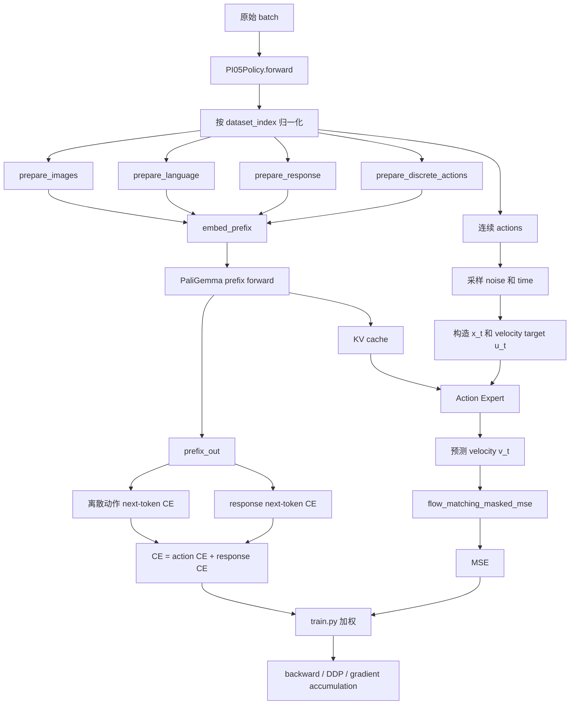
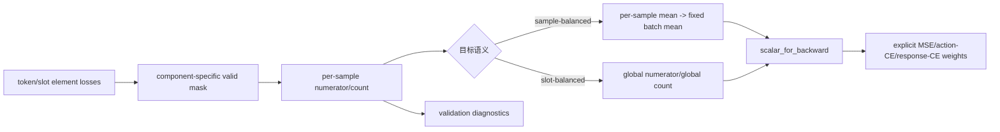

# PI0.5 Loss 计算流程与漏洞分析

## 1. 文档目的

本文分析 OpenTau 中 PI0.5 policy 的训练 loss，覆盖：

1. 从原始 batch 到模型 loss 的完整调用链。
2. 离散动作 CE、response CE 与连续动作 flow-matching MSE 的底层算法。
3. token shift、attention mask、loss mask、padding 和 reduction 的具体语义。
4. 单机、DDP 和 gradient accumulation 下实际优化目标的差异。
5. 已确认缺陷、潜在风险、影响范围、严重程度和修复必要性。

主要源码：

- [`src/opentau/policies/pi05/modeling_pi05.py`](../../src/opentau/policies/pi05/modeling_pi05.py)
- [`src/opentau/policies/pi05/configuration_pi05.py`](../../src/opentau/policies/pi05/configuration_pi05.py)
- [`src/opentau/policies/pi05/paligemma_with_expert.py`](../../src/opentau/policies/pi05/paligemma_with_expert.py)
- [`src/opentau/policies/utils.py`](../../src/opentau/policies/utils.py)
- [`src/opentau/scripts/train.py`](../../src/opentau/scripts/train.py)

## 2. 结论摘要

| ID | 问题 | 结论 | 严重度 | 是否必须修复 |
|---|---|---|---|---|
| B1 | MSE 在 DDP/梯度累积下按局部有效槽位归一化 | 已确认 | 高 | 异构 DoF、多 GPU 或有效 mask 波动时必须 |
| B2 | 空 response 仍产生 CE，EOS 后字符也被监督 | 已确认 | 高 | `predict_response=True` 且存在空 response 时必须 |
| B3 | CE 对固定最大长度求均值，padding 进入分母 | 已确认 | 中高 | 建议作为训练正确性问题修复 |
| B4 | 训练 CE/MSE 与 validation/running-best 的 reduction 语义不一致 | 已确认 | 中高 | 使用 validation 选 checkpoint 时必须 |
| R1 | padded action timestep 仍参与 action expert attention | 机制已确认，损害待量化 | 中 | 建议实验后修复 |
| R2 | 缺失 `action_is_pad`/`real_action_dim` 时 fail-open | 已确认 | 中低 | 自定义或旧数据管线应修复 |
| R3 | 离散动作 token 超长时直接截断 | 已确认 | 中低 | 发生截断时必须处理 |

以下核心算法没有发现明显错误：

- 离散动作和 response 的 next-token shift 没有 off-by-one。
- flow-matching 的插值公式、velocity target 符号和推理 Euler 积分方向一致。
- MSE 在单个 local batch 内正确排除了 frozen prefix、episode padding 和 padded action dimensions。
- CE logits 和 MSE prediction 在计算 loss 前上采样到 FP32。
- 全部 MSE 槽位被 mask 时不会产生 NaN。

## 3. 总体调用链



训练端最终使用：

```text
total_loss = loss_weighting["MSE"] * MSE
           + loss_weighting["CE"]  * CE
```

默认配置中两个权重均为 `1`。因此 MSE 和 CE 自身的 reduction 尺度直接决定两类目标的实际相对权重。

## 4. 关键张量和符号

| 符号 | 代码变量 | 典型 shape | 含义 |
|---|---|---|---|
| \(B\) | `batch_size` | scalar | local micro-batch size |
| \(C\) | `chunk_size` | scalar，默认 50 | 连续动作预测 horizon |
| \(D\) | `max_action_dim` | scalar，默认 32 | padding 后动作维数 |
| \(L_A\) | `discrete_action_max_length` | scalar，默认 32 | 离散动作 token 最大长度 |
| \(L_R\) | `response_max_length` | scalar，默认 52 | response token 最大长度 |
| \(a\) | `actions` | `(B, C, D)` | 归一化连续动作 |
| \(\epsilon\) | `noise` | `(B, C, D)` | 高斯噪声 |
| \(t\) | `time` | `(B)` 或 `(B, C)` | flow-matching 时间 |
| \(x_t\) | `x_t` | `(B, C, D)` | action 与 noise 的插值 |
| \(u_t\) | `u_t` | `(B, C, D)` | 目标 velocity |
| \(v_t\) | `v_t` | `(B, C, D)` | action expert 预测 velocity |
| \(m_A\) | `discrete_action_masks` | `(B, L_A)` | 有效离散动作 token mask |
| \(m_R\) | `response_masks` | `(B, L_R)` | 有效 response token mask |
| \(m_T\) | `~actions_is_pad` | `(B, C)` | 有效动作 timestep mask |
| \(m_D\) | action-dim mask | `(B, D)` | 每个样本的真实动作维 mask |

## 5. 输入准备与归一化

### 5.1 Dataset 路由

`PI05Policy.forward` 首先解析 `dataset_index`。异构数据集共训时，它用于选择对应数据集的 normalization statistics。

### 5.2 连续动作

连续动作通过 `normalize_targets` 使用 policy 的 `ACTION` normalization mode。默认是 mean/std normalization。

异构动作维数被 padding 到 `max_action_dim`。数据管线额外提供：

```text
real_action_dim: (B,)
```

它记录每个样本 padding 前的真实动作维数。

### 5.3 离散动作

离散动作使用 min/max normalization，然后交给 FAST action tokenizer。token 序列通过 `pad_discrete_tokens`：

- 超过 `discrete_action_max_length`：截断；
- 不足最大长度：右侧补 token ID `0`；
- `discrete_action_masks=True`：真实 token；
- `discrete_action_masks=False`：padding token。

### 5.4 Response

启用 `predict_response` 后，当前实现构造：

```python
response_prompt = [f"{response}<eos>;\n" for response in responses]
```

随后 tokenizer：

- 右侧 padding；
- 截断到 `response_max_length`；
- 返回 `response_tokens` 和 `response_masks`。

这里的 `response_masks` 是 tokenizer attention mask，不是专门定义的 response loss mask。

## 6. Prefix 序列结构

训练 prefix 的尾部结构可以抽象为：

```text
[image tokens]
[prompt tokens]
[optional continuous-state tokens]
[Response: indicator]
[response tokens, fixed L_R]
[Action: indicator]
[discrete action tokens, fixed L_A]
```

当 `predict_response=False` 时，response indicator 和 response tokens 不存在。

`embed_prefix` 为不同段构造 embedding、padding mask 和 autoregressive block mask，然后执行 PaliGemma prefix forward，产生：

```text
prefix_out: 每个 prefix 位置的 hidden state
past_key_values: 提供给 continuous-action expert 的 KV cache
```

CE 使用 `prefix_out`。连续动作 MSE 使用 KV cache，但在进入 action expert 前将 key/value detach：

```text
MSE gradient -> action expert / action projections
MSE gradient -X-> VLM prefix backbone
```

因此当前联合训练的主要梯度职责是：

| Loss | 主要训练对象 |
|---|---|
| Discrete-action CE | PaliGemma prefix、discrete action embedding/head |
| Response CE | PaliGemma prefix、language LM head |
| Flow-matching MSE | action expert、action input/output projection、time MLP |

## 7. 离散动作 CE

### 7.1 Next-token prediction

假设尾部 token 是：

```text
... [Action indicator last token] A0 A1 A2 ... A(L_A-1)
```

自回归模型位置 \(i\) 的 hidden state 用于预测位置 \(i+1\)：

```text
hidden(Action indicator last) -> A0
hidden(A0)                    -> A1
hidden(A1)                    -> A2
...
hidden(A(L_A-2))              -> A(L_A-1)
hidden(A(L_A-1))              -> 不参与 action CE
```

代码使用：

```python
discrete_token_start = -discrete_action_max_length
discrete_action_slice = slice(discrete_token_start - 1, -1)
```

得到长度为 \(L_A\) 的 hidden-state 序列：

```text
[Action indicator last, A0, A1, ..., A(L_A-2)]
```

labels 是：

```text
[A0, A1, A2, ..., A(L_A-1)]
```

二者严格一位错开。因此第一 action token 确实由 `"Action: "` indicator 的最后一个 token 位置预测，不存在 off-by-one。

需要注意：“由 indicator token 预测”不表示模型只看到了 indicator。该 hidden state 通过 attention 已经看到图像、prompt、state、response 和整个 action indicator。

### 7.2 Cross entropy 公式

对每个 token：

\[
\ell_{b,s}^{A}
=
-\log
\frac{\exp z_{b,s,y_{b,s}}}
{\sum_{k=1}^{V_A}\exp z_{b,s,k}}
\]

其中：

- \(z\) 是 `da_head` 输出 logits；
- \(V_A\) 是 FAST action vocabulary size；
- \(y\) 是目标 action token。

PyTorch 实现：

```python
F.cross_entropy(logits, labels, reduction="none")
```

得到 `(B, L_A)` token-wise loss。

### 7.3 Padding mask

padding token 的 CE 先正常计算，再乘有效 mask：

```python
masked_action_ce = token_ce * discrete_action_masks
```

padding token 对最终梯度贡献为零。虽然先计算再清零会浪费少量计算，但本身不会造成错误。

### 7.4 当前 scalar reduction

当前训练 scalar 是：

\[
L_A^{train}
=
\frac{
\sum_{b=1}^{B}\sum_{s=1}^{L_A}
m^A_{b,s}\ell^A_{b,s}
}{
B L_A
}
\]

注意分母是固定的 \(B L_A\)，不是有效 token 数：

\[
\sum_{b,s}m^A_{b,s}
\]

因此 padding 虽然不进入分子，却进入分母。

## 8. Response CE

### 8.1 Token shift

假设 tokenizer 输出：

```text
[BOS, R0, R1, ..., EOS, padding...]
```

response hidden states 和 labels 对齐为：

```text
hidden(BOS) -> R0
hidden(R0)  -> R1
...
hidden(last supervised token - 1) -> last supervised token
```

代码：

```python
response_out = prefix_out[:, response_token_start:response_token_end]
response_labels = response_tokens[:, 1:]
```

二者长度都是 `response_max_length - 1`，shift 正确。

### 8.2 当前 scalar reduction

response token CE 同样先乘 `response_masks[:, 1:]`，然后对完整固定 shape 求均值：

\[
L_R^{train}
=
\frac{
\sum_{b=1}^{B}\sum_{s=1}^{L_R-1}
m^R_{b,s}\ell^R_{b,s}
}{
B(L_R-1)
}
\]

最终：

\[
L_{CE}^{train}=L_A^{train}+L_R^{train}
\]

如果 `predict_response=False`，则 \(L_R^{train}=0\)。

## 9. Flow-matching MSE

### 9.1 Flow matching 的目标

令：

- 数据动作 \(x_0=a\)；
- 高斯噪声 \(x_1=\epsilon\)；
- 时间 \(t\in(0,1]\)。

模型使用线性 probability path：

\[
x_t=(1-t)a+t\epsilon
\]

代码等价于：

```python
x_t = time * noise + (1 - time) * actions
```

对时间求导：

\[
\frac{d x_t}{dt}=\epsilon-a
\]

因此目标 velocity 是：

\[
u_t=\epsilon-a
\]

代码：

```python
u_t = noise - actions
```

action expert 预测：

\[
v_\theta(x_t,t,\text{context})
\]

基本 loss：

\[
\ell^{MSE}_{b,c,d}
=
\left(
v_{\theta,b,c,d}-u_{t,b,c,d}
\right)^2
\]

### 9.2 时间采样

时间来自：

\[
t\sim\operatorname{Beta}(1.5,1)
\]

随后映射到：

\[
t'=0.999t+0.001
\]

因此普通 action timestep 不会采到严格的 0。

### 9.3 Real-time inference delay

每个样本随机采样：

```text
delay in [0, max_delay]
```

前 `delay` 个 action timestep 被视为已经执行或冻结的 action prefix：

```text
prefix_mask=True
time=0
x_t=action
```

这些 timestep 不要求模型重新预测，因此从 MSE 中排除。

### 9.4 三层 MSE mask

`flow_matching_masked_mse` 组合三种 mask：

1. Frozen prefix：

   \[
   m^P_{b,c}=\neg prefix\_mask_{b,c}
   \]

2. Episode-bound timestep：

   \[
   m^T_{b,c}=\neg actions\_is\_pad_{b,c}
   \]

3. Real action dimension：

   \[
   m^D_{b,d}=[d<real\_action\_dim_b]
   \]

完整 mask：

\[
m_{b,c,d}=m^P_{b,c}\land m^T_{b,c}\land m^D_{b,d}
\]

### 9.5 当前 local scalar reduction

单个 local micro-batch 内：

\[
L_{MSE}^{local}
=
\frac{
\sum_{b,c,d}m_{b,c,d}\ell^{MSE}_{b,c,d}
}{
\sum_{b,c,d}m_{b,c,d}+\varepsilon
}
\]

其中 \(\varepsilon=10^{-8}\)。

这是 local batch 内正确的有效槽位均值：

- frozen action 不进入分子和分母；
- episode padding 不进入分子和分母；
- 异构数据的 padded action dimensions 不进入分子和分母；
- 如果全部被 mask，结果是 `0 / 1e-8 = 0`，不会产生 NaN。

### 9.6 推理方向验证

训练路径定义：

\[
x_0=a,\quad x_1=\epsilon,\quad
\frac{dx_t}{dt}=\epsilon-a
\]

推理从 \(t=1\) 的 noise 开始，使用负步长：

\[
\Delta t=-\frac{1}{N}
\]

Euler 更新：

\[
x_{t+\Delta t}=x_t+\Delta t\,v_\theta(x_t,t)
\]

因为 \(\Delta t<0\)，积分方向从 noise 走向 action。训练 target 符号与推理方向一致。

## 10. 训练端联合 loss

`train.py::update_policy` 执行：

```python
loss = mse_weight * losses["MSE"] + ce_weight * losses["CE"]
accelerator.backward(loss)
```

没有发现模型内和训练脚本重复加权的问题。

但两个 loss 的 reduction 单位不同：

| Loss | 当前单位 |
|---|---|
| MSE | local micro-batch 内每个有效 `(sample, timestep, action_dim)` 槽位的均值 |
| Action CE | 每个固定 action token 槽位的均值，padding 在分母中 |
| Response CE | 每个固定 response token 槽位的均值，padding 在分母中 |

因此 `MSE=1, CE=1` 不表示两种任务获得可直观比较的相同权重。

## 11. Validation 的 reduction

启用 `return_per_sample=True` 后，模型额外返回：

```text
PerSampleLoss(sum, count)
```

### 11.1 MSE validation

每个样本保存有效 MSE 的 numerator 和有效槽位 count。validation 按 group 聚合：

\[
L_{MSE}^{val,group}
=
\frac{
\sum_{b\in group}sum_b
}{
\sum_{b\in group}count_b+\varepsilon
}
\]

### 11.2 CE validation

`ce_per_sample` 保存：

```text
sum   = 有效 token CE 总和
count = 有效 token 数
```

action CE 和 response CE 的 `PerSampleLoss` 被直接相加，然后 validation 使用：

\[
L_{CE}^{val,group}
=
\frac{
\sum action\_ce+\sum response\_ce
}{
\#valid\_action\_tokens+\#valid\_response\_tokens
}
\]

这与训练的：

\[
\frac{\sum action\_ce}{B L_A}
+
\frac{\sum response\_ce}{B(L_R-1)}
\]

不是同一个目标。

validation aggregate 还可能用于 running-best checkpoint 选择，因此该差异不仅影响日志。

## 12. Bug B1：MSE 的 distributed/global reduction 不正确

### 12.1 根因

每个 rank 先独立计算：

\[
L_r=\frac{N_r}{C_r}
\]

其中：

- \(N_r\)：rank \(r\) 的有效 MSE 总和；
- \(C_r\)：rank \(r\) 的有效槽位数。

DDP 默认对各 rank 梯度做等权平均。因此实际目标近似为：

\[
L_{DDP}
=
\frac{1}{R}
\sum_{r=1}^{R}\frac{N_r}{C_r}
\]

如果目标是整个 global batch 的有效槽位均值，正确公式应为：

\[
L_{global}
=
\frac{
\sum_rN_r
}{
\sum_rC_r
}
\]

通常：

\[
\frac{1}{R}\sum_r\frac{N_r}{C_r}
\ne
\frac{\sum_rN_r}{\sum_rC_r}
\]

### 12.2 数值例子

两个 rank：

| Rank | 有效槽位数 \(C_r\) | MSE 总和 \(N_r\) | local mean |
|---|---:|---:|---:|
| 0 | 4 | 4 | 1 |
| 1 | 12 | 36 | 3 |

当前 DDP 目标：

\[
(1+3)/2=2
\]

global valid-slot mean：

\[
(4+36)/(4+12)=2.5
\]

当前实现让两个 rank 各占 50% 权重；global slot mean 应让它们分别占 25% 和 75%。

更极端时，如果 rank 0 全部被 mask：

```text
rank 0 local MSE = 0
rank 1 local MSE = 3
DDP average       = 1.5
```

有效数据的梯度被无效 rank 稀释一半。

### 12.3 Gradient accumulation

多个 micro-batch 分别计算 `local_sum / local_count`，Accelerate 再按 accumulation step 等权缩放。

如果各 micro-batch 的有效槽位数不同，同样得到“micro-batch mean 的均值”，而不是 accumulation window 内的全局有效槽位均值。

### 12.4 触发条件

- 不同数据集具有不同 `real_action_dim`；
- episode 尾部的 `action_is_pad` 比例不同；
- `max_delay > 0` 导致 frozen prefix 数不同；
- batch 中含全 action-padding 的 VQA 样本；
- DDP 各 rank 恰好分到不同组成的数据；
- `gradient_accumulation_steps > 1` 且各 micro-batch count 不同。

### 12.5 影响范围

- 改变不同数据集、不同 DoF 和不同 episode 位置的训练权重；
- world size 或 micro-batch 切分变化会改变优化目标；
- 单 GPU 与多 GPU loss/gradient 不严格等价；
- validation 使用全局 numerator/count，和训练目标不一致；
- 同 seed 在不同并行拓扑下无法期待相同训练语义。

### 12.6 严重程度

**高。**

对于单数据集、固定动作维、无 padding、`max_delay=0`、不做 gradient accumulation 的场景，所有 local count 基本一致，问题退化为无影响。

对于 OpenTau 重点支持的 heterogeneous co-training，该条件通常不成立。

### 12.7 是否必须修复

- 异构 DoF、多 GPU或大量 episode padding：**必须修复**。
- 单 GPU、固定 shape 的传统训练：可以短期延后，但应记录目标限制。

### 12.8 修复方向

必须先明确期望目标：

1. **Global valid-slot mean**

   所有 rank 和 accumulation micro-batch 的 numerator/count 共同归一化。

2. **Per-sample mean，再对固定样本数求均值**

   每个样本权重相等，不让高 DoF 或长有效 horizon 自然获得更多权重。

3. **Per-dataset 显式权重**

   先在样本或数据集内部归一化，再由 mixture weights 控制任务权重。

如果选择 global valid-slot mean，DDP 不能简单 all-reduce denominator 后直接使用 `local_sum/global_count`，因为 DDP 还会平均梯度。需要补偿 DDP 的 `1/world_size`，并处理整个 accumulation window 的 denominator。

## 13. Bug B2：空 response 和 EOS 后 token 被错误监督

### 13.1 根因

源码注释声明：

```text
response == "" 表示该样本不计算 response loss
```

但实际构造：

```python
f"{response}<eos>;\n"
```

当 `response == ""` 时，输入仍至少包含：

```text
<eos> ; newline
```

tokenizer 会把这些标记为非 padding token，因此 `response_masks=True`，最终进入 CE。

此外，即使 response 非空，`<eos>` 后的 `";\n"` 也仍然是有效 label。

### 13.2 与推理的矛盾

推理生成逻辑在历史 token 中检测到 EOS 后：

- 后续 token 强制变成 PAD；
- 后续 response token 不再作为有效 prefix。

训练却要求模型在 EOS 后继续预测 `";\n"`。这构成明确的 train/inference mismatch。

### 13.3 影响范围

仅在 `predict_response=True` 时触发，主要影响：

- robotic dataset 中以空字符串表示“无 response supervision”的样本；
- VQA 与 robotic data 混训；
- response generation 的停止行为；
- response CE 与 action CE 的相对权重。

### 13.4 严重程度

**高，但有配置条件。**

`predict_response=False` 时完全不受影响。启用 response prediction 且包含空 response 时，属于明确标签错误。

### 13.5 是否必须修复

启用 `predict_response` 的正式训练前 **必须修复**。

### 13.6 修复方向

不要复用 tokenizer attention mask 作为 loss mask。应单独构造：

```text
response_attention_mask
response_loss_mask
```

建议语义：

- 非空 response：监督正文和第一个 EOS；
- EOS 后 token：不监督；
- 空 response：`response_loss_mask` 全 False；
- 是否让空 response token 进入 attention，应由模型上下文设计单独决定。

同时建议直接编码：

```text
response + EOS
```

避免在 EOS 后附加需要生成的普通字符。

## 14. Bug B3：CE padding 进入分母

### 14.1 根因

当前流程是：

```python
token_ce = cross_entropy(..., reduction="none")
masked_ce = token_ce * valid_mask
scalar_ce = masked_ce.mean()
```

`.mean()` 对整个 `(B, fixed_sequence_length)` 求均值。因此 padding loss 虽然被清零，padding 槽位仍计入分母。

### 14.2 数值例子

假设所有有效 token 的 CE 都是 `2`：

| Component | 有效 token | 最大长度 | CE 总和 | 当前 scalar |
|---|---:|---:|---:|---:|
| Action | 4 | 32 | 8 | `8/32=0.25` |
| Response | 10 | 51 | 20 | `20/51=0.392` |

当前训练 CE：

```text
0.25 + 0.392 = 0.642
```

如果按全部有效 token 求均值：

```text
(8 + 20) / (4 + 10) = 2.0
```

两者不仅数值尺度不同，action/response 的相对权重也不同。

### 14.3 具体影响

1. **短 token 序列被系统性降权**

   有效 token 越少，loss 越小，即使每个 token 的预测质量完全相同。

2. **tokenizer 变化会改变训练权重**

   更高压缩率的 tokenizer 产生更少 token，反而获得更小梯度。

3. **异构 action dimension 可能间接改变 CE 权重**

   FAST token 长度随动作内容、维数或 tokenizer 配置变化时，不同数据集得到不同隐式权重。

4. **CE/MSE 相对权重不稳定**

   配置中的 `loss_weighting["CE"]` 无法独立表达真实 CE 权重，因为有效 token 比例也参与缩放。

5. **Action CE 与 response CE 缺少显式任务权重**

   当前先分别除以固定最大长度再相加。它既不是所有 token 的统一均值，也不是清晰定义的 per-task weighting。

### 14.4 严重程度

**中高。**

它通常不会导致 NaN 或直接训练崩溃，但会持续改变训练目标和多数据集权重，是典型的“loss 曲线看起来正常、实际权重错误”的 ML bug。

### 14.5 是否必须修复

建议修复。尤其在以下场景应视为必须：

- 调整 FAST tokenizer；
- heterogeneous dataset mixture；
- 启用 response CE；
- 使用 CE/MSE loss 值比较实验或选择超参数。

### 14.6 推荐 reduction

应明确选择一种语义。

#### 方案 A：每样本有效 token 均值

\[
L_b
=
\frac{\sum_s m_{b,s}\ell_{b,s}}
{\max(\sum_s m_{b,s},1)}
\]

然后对 batch 求均值。这与官方 OpenPI FAST loss 的基本语义接近，每个样本权重更稳定。

#### 方案 B：global valid-token mean

\[
L
=
\frac{\sum_{b,s}m_{b,s}\ell_{b,s}}
{\sum_{b,s}m_{b,s}}
\]

每个有效 token 权重相同，但必须正确处理 DDP 和 gradient accumulation 的 global denominator。

#### 方案 C：component-wise valid mean

\[
L_{CE}
=
w_A
\frac{\sum m^A\ell^A}{\sum m^A}
+
w_R
\frac{\sum m^R\ell^R}{\sum m^R}
\]

该方案最容易明确表达离散动作与 response 的任务权重。建议把 \(w_A,w_R\) 变成显式配置，而不是依赖最大长度和 padding 比例。

## 15. Bug B4：训练与 validation loss 不是同一个目标

### 15.1 CE 不一致

训练：

\[
\frac{\sum action\_ce}{B L_A}
+
\frac{\sum response\_ce}{B(L_R-1)}
\]

validation：

\[
\frac{
\sum action\_ce+\sum response\_ce
}{
\#valid\ action+\#valid\ response
}
\]

### 15.2 MSE 不一致

训练在 DDP/accumulation 下是 local masked mean 的等权组合。

validation 将 per-sample numerator/count 跨 rank gather 后，按 group 计算有效槽位总均值。

### 15.3 影响

- `Training/Loss` 与 `Validation/Loss` 不可直接比较；
- validation 下降不一定表示训练优化目标下降；
- running-best checkpoint 可能按另一个目标选模型；
- CE/MSE 权重在训练和 checkpoint selection 中不同；
- 实验报告可能误把 reduction 差异解释为泛化差异。

### 15.4 严重程度

**中高。**

如果 validation 仅用于辅助观察，影响主要是指标解释。如果 `running_best_metric` 使用 validation loss，它会直接影响保留哪个 checkpoint。

### 15.5 是否必须修复

使用 validation loss 选择 checkpoint 时 **必须修复**。

### 15.6 修复方向

建议建立统一的 loss statistics：

```text
LossStats:
    numerator
    denominator
    scalar_for_backward
```

训练和 validation 必须共享相同的 reduction 定义。若还需要 per-token、per-sample、per-dataset 等诊断指标，应使用不同 metric 名称明确区分，例如：

```text
Optimization/CE
Diagnostics/CE_per_valid_token
Diagnostics/CE_per_sample
```

## 16. 风险 R1：padded action timestep 仍参与 attention

### 16.1 已确认机制

`actions_is_pad` 被传给 `flow_matching_masked_mse`，只用于 MSE reduction。

但 `embed_suffix` 当前为所有 action timestep 创建全 True 的 `suffix_pad_masks`。action expert 的 action block 又允许 block 内 token 相互 attention。

因此：

- padded timestep 的输出不计 MSE；
- padded timestep 的输入表示仍可能被有效 timestep attention；
- 模型没有从 suffix pad mask 获知哪些 timestep 无真实 action target。

### 16.2 潜在影响

episode 尾部的有效动作预测可能依赖不存在的 future action slots。由于这些 slots 中的 \(x_t\) 包含 noise 或 padding action，它们并非严格中性输入。

可能造成：

- episode-boundary 样本的条件污染；
- train/inference 差异；
- 模型利用 padding pattern；
- 有效 MSE 虽然 mask 正确，预测它的 hidden state 仍受 padding 影响。

### 16.3 证据等级

- padded token 参与 attention：**代码事实**；
- 一定造成显著精度下降：**尚未动态验证**。

### 16.4 严重程度与建议

**中等风险。**

建议增加对照实验：

1. 仅 mask padded timestep 的 attention key；
2. 同时 mask query/key，但验证 eager/SDPA 的全 mask row 数值行为；
3. 保持 attention 不变，但将 padded \(x_t\) 设为确定性中性值；
4. 比较 episode-boundary loss 和 rollout success。

## 17. 风险 R2：mask 字段缺失时静默 fail-open

### 17.1 当前行为

```text
actions_is_pad is None -> 所有 timestep 有效
real_action_dim is None -> 所有 max_action_dim 列有效
```

这为旧调用方提供兼容性，但也可能静默重新引入 padding loss。

`make_action_dim_mask` 目前主要检查 batch shape，不完整验证：

- dtype 是否是 integer；
- 值是否小于 0；
- 值是否大于 `max_action_dim`。

### 17.2 影响范围

- 自定义 dataset；
- 旧 checkpoint 配套的数据管线；
- 绕过标准 dataset factory 的单元测试或脚本；
- 第三方 LeRobot-compatible dataset。

### 17.3 建议

训练模式下建议 fail-fast：

```text
heterogeneous/padded actions -> 必须提供 real_action_dim
chunk padding enabled        -> 必须提供 action_is_pad
```

并验证：

\[
0\le real\_action\_dim\le max\_action\_dim
\]

## 18. 风险 R3：离散动作 token 截断

FAST token 长度超过 `discrete_action_max_length` 时，当前代码仅记录 warning，然后截断。

被截断后：

- CE 只监督动作编码前缀；
- 离散 action representation 可能不可逆；
- warning 在大规模训练日志中容易被忽略；
- continuous MSE 仍可正常训练，因此总体 loss 不一定显露异常。

建议在训练初始化或首批数据上统计：

```text
token length min / p50 / p95 / p99 / max
truncation rate
```

正式训练中截断率大于 0 时，建议默认报错，除非配置显式允许。

## 19. 为什么这些问题不容易从 loss 曲线发现

这些问题大多不会产生异常数值：

- padding 被乘零，loss 保持有限；
- 全 mask MSE 返回 0；
- CE 固定分母只会缩放梯度；
- DDP local mean 仍是合法标量；
- 空 response 仍有合法 token label；
- validation 也会产生平滑曲线。

因此 loss 可能持续下降，但下降的是与预期不同的目标。必须通过手算 reduction、mask 覆盖和跨并行拓扑测试发现。

## 20. 修复优先级

| 优先级 | 项目 | 条件 |
|---|---|---|
| P0 | B1：统一 MSE distributed/accumulation reduction | 多 GPU、异构 DoF、VQA/robot 混训 |
| P0 | B2：独立 response loss mask | `predict_response=True` |
| P1 | B3：CE 改为明确的 valid-token/per-sample reduction | 所有 PI0.5 CE 训练 |
| P1 | B4：训练和 validation 使用同一 loss 定义 | validation 选 checkpoint |
| P2 | R1：评估 padded timestep attention | episode 尾部 padding 较多 |
| P2 | R2：mask 和 action dim fail-fast | 第三方数据管线 |
| P2 | R3：token truncation 统计和硬检查 | 自定义 FAST tokenizer |

## 21. 推荐修复架构



建议将三个 component 独立表示：

```text
MSE
ACTION_CE
RESPONSE_CE
```

不要先把两类 CE 隐式相加后只暴露一个权重。推荐配置语义：

```json
{
  "loss_weighting": {
    "MSE": 1.0,
    "ACTION_CE": 1.0,
    "RESPONSE_CE": 1.0
  }
}
```

为保持公共配置兼容，可以继续接受旧的 `"CE"`，并将其作为两个 CE component 的默认权重。

## 22. 验证计划

修复 loss 属于训练 loop/model 变更，应遵守仓库 determinism 要求。

### 22.1 单元测试

建议新增 `tests/policies/test_pi05_loss.py`：

1. **Discrete CE shift**

   构造可识别位置的 hidden states/logits，证明：

   ```text
   Action indicator last -> A0
   A0 -> A1
   ...
   ```

2. **Response shift**

   验证 BOS 不作为 label，第一正文 token 由 BOS hidden state 预测。

3. **Empty response**

   `response=""` 时 response loss numerator/count 都为 0。

4. **EOS boundary**

   第一个 EOS 可以被监督，EOS 后所有 token loss mask 为 False。

5. **CE padding invariance**

   给相同有效 token 追加不同数量 padding，canonical CE 不变。

6. **MSE mask**

   手算 frozen prefix、timestep padding 和 real action dims 的交集。

7. **All-masked sample**

   loss 和 gradient 有限，不产生 NaN。

8. **Training/validation parity**

   scalar loss 与从 `PerSampleLoss(sum,count)` 重建的 canonical loss 一致。

### 22.2 Distributed 测试

使用两个 CPU/Gloo rank 构造不同 count：

```text
rank 0: 4 valid slots
rank 1: 12 valid slots
```

断言分布式 gradient 等于单进程拼接 global batch 的 gradient。

还需覆盖：

- 某个 rank count 为 0；
- gradient accumulation 的 micro-batch count 不同；
- 不同 `real_action_dim`；
- 不同 `actions_is_pad`。

### 22.3 推荐命令

按仓库规则先运行 pre-commit：

```bash
pre-commit run --all-files
pytest -sx tests/policies/test_pi05_loss.py -n 0
pytest -sx tests/policies/test_action_dim_mask.py -n 0
pytest -m "not gpu and not network" -n auto
```

如修改训练 loop 或模型，使用允许的 smoke config 连续运行两次：

```bash
accelerate launch --num_processes 1 \
  src/opentau/scripts/train.py \
  --config_path=configs/dev/dev_config.json
```

两次必须使用同一 seed，并确认逐 step loss 序列 bit-identical。

禁止使用真实长训练配置验证本修复。

## 23. 风险与回滚

### 23.1 Loss 尺度变化

修复 CE 分母后，CE 数值通常会上升，因为 padding 不再进入分母。历史 loss 曲线将不可直接比较。

必须：

- 在 release note 中记录 reduction 变化；
- 重新评估 `loss_weighting`；
- 不把修复前后的 scalar loss 绝对值直接比较。

### 23.2 Checkpoint 行为变化

修复 validation parity 后，running-best checkpoint 可能选择不同 step。这是目标修正后的预期行为。

### 23.3 Distributed 复杂度

global slot mean 需要正确处理 DDP gradient averaging 和 accumulation denominator。实现不完整可能引入额外 collective 或 rank mismatch。

所有 rank 必须执行相同 collective 次数。

### 23.4 回滚

建议将修复拆成独立 commit：

1. response loss mask；
2. CE canonical reduction；
3. distributed MSE reduction；
4. validation parity；
5. padded action attention 实验。

这样可以在出现训练回归时单独回滚，不影响其他修复。

## 24. 最终判断

PI0.5 当前 loss 的基础数学方向是正确的：

- 自回归 token shift 正确；
- flow-matching target 正确；
- local MSE mask 的集合逻辑正确；
- dtype 和空 mask 数值处理合理。

主要问题集中在 **监督范围和 reduction 语义**：

1. response loss mask 与注释/推理不一致；
2. CE padding 被计入分母；
3. train 和 validation 计算的不是同一个 CE/MSE 目标；
4. local masked mean 在 DDP 和 gradient accumulation 下不等于 global masked mean。

这些问题不会让训练立即失败，却会改变任务权重、数据集权重和 checkpoint 选择。对于异构多数据集、多 GPU 和 response-enabled 训练，不应视为单纯的日志尺度问题，而应作为训练正确性问题处理。

## 25. 审计限制

本文是静态代码审计。当前执行环境的 WSL shell 创建失败，因此未在本轮运行本地 pytest、GPU 测试或训练 smoke run。实施修复后必须执行第 22 节验证计划，并按仓库要求检查同 seed 双跑的逐 step loss determinism。
